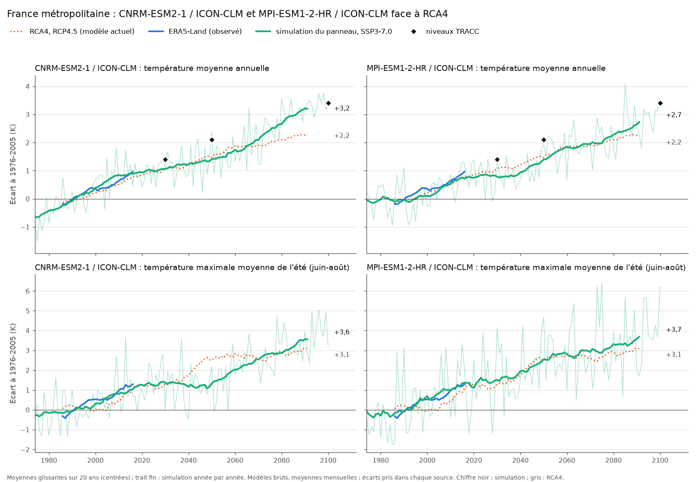

# Choix du modèle CORDEX-CMIP6 : MPI-ESM1-2-HR / ICON-CLM

Décision du 06/10/2026 : le couple EC-EARTH / RCA4 (CMIP5, RCP4.5) sera remplacé par MPI-ESM1-2-HR / ICON-CLM-202407-1-1 (CMIP6, SSP3-7.0, EUR-12).

| | Actuel | Retenu |
|---|---|---|
| Modèle global | EC-EARTH (CMIP5), r12i1p1 | MPI-ESM1-2-HR (CMIP6), r1i1p1f1 |
| Modèle régional | SMHI-RCA4 | ICON-CLM-202407-1-1 (CLMcom-DWD) |
| Domaine | EUR-11, 0,11° | EUR-12, 0,11° (même type de grille, pôle tourné) |
| Scénario | RCP4.5 après 2005 | SSP3-7.0 après 2014 |
| Source | CDS | ESGF (catalogue STAC, https://api.stac.esgf.ceda.ac.uk, collection CORDEX-CMIP6) |
| Licence | | CC BY 4.0 |

## 1. Motif : RCA4 trop froid

RCA4 brut est trop froid sur la France (Tx d'été 2006-2025 : −1,8 K contre ERA5-Land) et son réchauffement est trop lent : +2,2 K en 2081-2100 par rapport à 1976-2005, quand la TRACC prévoit +3,4 K en 2100 sur la même référence (+4 °C par rapport à 1850-1900).

## 2. Candidats

Sept simulations EURO-CORDEX-CMIP6 SSP3-7.0 disponibles sur ESGF ont été comparées en moyennes mensuelles sur la France (`figures/climat/cmip6_tri.py`, `cmip6_tri.log`). Deux sont retenues pour la comparaison finale, pilotées par les deux modèles globaux les mieux évalués (section 4) et descendues par le même modèle régional : CNRM-ESM2-1 / ICON-CLM (CLMcom-BTU) et MPI-ESM1-2-HR / ICON-CLM (CLMcom-DWD).

`figures/climat/cmip6_choix.png` (`cmip6_choix.py`) : écarts à 1976-2005, moyennes glissantes sur 20 ans, modèles bruts.

| France, écart à 1976-2005 (K) | ERA5-Land | RCA4 | CNRM / ICON | MPI / ICON |
|---|---|---|---|---|
| Annuel 1996-2025 | +0,76 | +0,60 | +0,75 | +0,55 |
| Annuel 2016-2025 | +1,43 | +0,98 | +0,85 | +0,85 |
| Annuel 2041-2060 | | +1,57 | +1,43 | +1,40 |
| Annuel 2081-2100 | | +2,23 | +3,20 | +2,73 |
| Tx été 1996-2025 | +1,07 | +0,68 | +0,80 | +1,02 |
| Tx été 2041-2060 | | +2,64 | +1,45 | +2,53 |
| Tx été 2081-2100 | | +3,10 | +3,56 | +3,69 |
| Niveau TRACC +1,4 K atteint (TRACC : 2030) | | 2046 | 2050 | 2050 |
| Niveau TRACC +2,1 K atteint (TRACC : 2050) | | 2079 | 2071 | 2076 |

Niveau atteint : année centrale de la première moyenne glissante sur 20 ans qui dépasse le seuil.

## 3. Arguments

**Modèles plus récents.** Modèles globaux CMIP6 et modèle régional ICON-CLM de 2024, contre EC-EARTH (CMIP5) et RCA4. L'évolution des aérosols est obligatoire dans EURO-CORDEX-CMIP6 (Katragkou et al. 2024) ; ICON-CLM utilise MACv2-SP, variable dans le temps. Les modèles régionaux CORDEX à aérosols constants sous-estiment le réchauffement estival de l'Europe de l'Ouest et centrale d'environ 0,5 °C sur 1980-2022, et d'environ 1 °C en 2100 en émissions fortes (Schumacher et al. 2024). Piloté par ERA5, ICON-CLM retrouve environ 85 % de la tendance observée en France sur 1990-2024 (CNRM-ALADIN64E1 : environ 50 %).

**Biais brut faible.** Moyenne France, modèles bruts, contre ERA5-Land :

| Biais brut (K) | RCA4 | CNRM / ICON | MPI / ICON |
|---|---|---|---|
| Tx été 1976-2005 | | +0,01 | +0,01 |
| Tx été 2006-2025 | −1,82 | −0,25 | +0,08 |
| Température été 2006-2025 | −2,53 | −0,42 | −0,35 |
| Température annuelle 1976-2005 | | −0,36 | −0,13 |

RCA4 : données journalières (`cmip6_test.csv`) ; ICON : moyennes mensuelles (même masque France, même méthode ; pour CNRM, journalier et mensuel concordent à 0,01 K près). Le biais n'est pas uniforme : CNRM / ICON est trop froid de 4,6 K sur les Tx d'été à Madrid. Un biais faible demande une correction plus douce, qui déforme moins les liens entre variables.

**Modèles globaux bien évalués par la communauté.**
- Sélection EURO-CORDEX (Sobolowski et al. 2023, tableau 2) : MPI-ESM1-2-HR (r1i1p1f1) et CNRM-ESM2-1 (r1i1p1f2) font partie des modèles globaux retenus pour la descente d'échelle en Europe, avec une seule réserve chacun sur 20 et 19 critères.
- Réponse climatique transitoire (GIEC AR6 GT1, tableau 7.SM.5) : MPI-ESM1-2-HR 1,66 °C, CNRM-ESM2-1 1,86 °C, dans la fourchette probable du GIEC (1,4 à 2,2 °C). Sensibilité à l'équilibre : 2,98 et 4,76 °C (fourchette probable 2,5 à 4 °C).
- Climat actuel de l'Europe (Palmer et al. 2023, figure 5, comparaison à ERA5) : aucun critère inadéquat pour les deux. MPI-ESM1-2-HR : insatisfaisant sur les températures de surface de l'Atlantique Nord (hiver et été) et les précipitations d'Europe centrale. CNRM-ESM2-1 : insatisfaisant sur les blocages d'été (juin-septembre), la circulation d'été (vent à 850 hPa) et les températures de surface de l'Atlantique Nord en été.

**MPI plutôt que CNRM.**
- Mieux évalué sur l'été : CNRM-ESM2-1 est insatisfaisant sur les blocages et la circulation d'été, qui pilotent les vagues de chaleur ; MPI-ESM1-2-HR ne l'est pas.
- Pas de palier des Tx d'été : chez CNRM / ICON, les Tx d'été stagnent dans les années 2030 et 2040 (moyennes par décennie : 2020-2029 +1,59 K, 2030-2039 +1,16 K, 2040-2049 +1,17 K, 2050-2059 +1,51 K), puis rattrapent après 2060. MPI / ICON progresse régulièrement (+1,36, +1,66, +2,25, +2,86 K) et suit RCA4 et les observations sur 1996-2025 (+1,02 K contre +1,07 K pour ERA5-Land).
- Sensibilité à l'équilibre de CNRM-ESM2-1 (4,76 °C) au-dessus de la fourchette probable du GIEC.

## 4. Limites connues

- **Retard sur le réchauffement récent.** Toutes les simulations pilotées par un modèle global CMIP6 sont presque plates sur 2006-2025 (MPI / ICON : +0,20 K par décennie, ERA5-Land : +0,88). En 2016-2025, MPI / ICON est à +0,85 K contre +1,43 K observé. Ce retard est connu : les ensembles de modèles sous-estiment le réchauffement passé de la France, jusqu'à 50 % (Ribes et al. 2022), et la circulation favorable aux extrêmes chauds observée en Europe de l'Ouest n'est reproduite par aucune des 170 simulations étudiées par Vautard et al. 2023.
- **Sous la TRACC.** MPI / ICON atteint +2,73 K en 2081-2100 (moyenne annuelle, par rapport à 1976-2005), contre +3,4 K pour la TRACC en 2100.
- **Un seul membre.** Une partie des écarts entre simulations peut venir de la variabilité interne, non chiffrée à l'échelle de la France.
- **Défaut connu des aérosols d'ICON-CLM-202407-1-1** dans les scénarios (zenodo 19812905) : épaisseur optique des aérosols trop forte (environ 50 % selon l'attribut `comment` des fichiers MPI / ICON ; +34 % et +0,035 K en moyenne sur `tas` pour CNRM / ICON selon la note), décalage constant ; les simulations historiques ne sont pas touchées.

## 5. Suite

- **Téléchargement : fait le 7/10/2026.** Les 14 variables journalières, `sftlf` et `orog` : 394 fichiers, 1966-2100, environ 322 Go, version ESGF `v20260415`, sur le LaCie. Provenance, licence et attribution : `data/cordex/eur12_mpi-esm1-2-hr_icon-clm/PROVENANCE.md`.
- **Correction** : reprise de la chaîne existante (remappage depuis EUR-12, QDM contre ERA5 et ERA5-Land, calibration 1970-2005).
- **Ajustement sur la TRACC, à décider** : multiplier le changement du modèle par un facteur k(t) dans la correction (niveau TRACC / niveau du modèle, moyenne France sur 20 ans), d'environ 1,5 vers 2050 et 1,25 en 2100 (ordres de grandeur à recalculer). Alternative : servir l'année du modèle qui atteint le niveau TRACC de l'année demandée, approche par niveaux de réchauffement régionaux de la TRACC (Corre et al. 2025), limitée par le plafond du modèle. Dans les deux cas, l'humidité relative devra suivre le surplus de température.
- **Piste : classification de Köppen-Geiger** par maille et par période, calculée sur MPI / ICON corrigé (températures et précipitations mensuelles), validée contre les cartes de Beck et al. 2023 (1 km, 1901-2099, CMIP6 contraint, SSP3-7.0 compris).

## Références

- Beck, H. E., et al., 2023 : High-resolution (1 km) Köppen-Geiger maps for 1901–2099 based on constrained CMIP6 projections. Sci. Data, 10. https://doi.org/10.1038/s41597-023-02549-6
- Corre, L., Ribes, A., Bernus, S., Drouin, A., Morin, S., Soubeyroux, J.-M., 2025 : Using regional warming levels to describe future climate change for services and adaptation: Application to the French reference trajectory for adaptation. Climate Services. https://www.sciencedirect.com/science/article/pii/S2405880725000147
- GIEC, 2021 : Climate Change 2021: The Physical Science Basis, chapitre 7 et matériel supplémentaire (tableau 7.SM.5). https://www.ipcc.ch/report/ar6/wg1/downloads/report/IPCC_AR6_WGI_Chapter07_SM.pdf
- Katragkou, E., et al., 2024 : Delivering an Improved Framework for the New Generation of CMIP6-Driven EURO-CORDEX Regional Climate Simulations. Bull. Amer. Meteor. Soc., 105 (6). https://journals.ametsoc.org/view/journals/bams/105/6/BAMS-D-23-0131.1.xml
- Ministère de la Transition écologique : Trajectoire de réchauffement de référence pour l'adaptation au changement climatique (TRACC). https://www.ecologie.gouv.fr/politiques-publiques/trajectoire-rechauffement-reference-ladaptation-changement-climatique-tracc
- Palmer, T. E., McSweeney, C. F., Booth, B. B. B., et al., 2023 : Performance-based sub-selection of CMIP6 models for impact assessments in Europe. Earth Syst. Dynam., 14, 457-483. https://doi.org/10.5194/esd-14-457-2023
- Ribes, A., Boé, J., Qasmi, S., Dubuisson, B., Douville, H., Terray, L., 2022 : An updated assessment of past and future warming over France based on a regional observational constraint. Earth Syst. Dynam., 13, 1397-1415. https://esd.copernicus.org/articles/13/1397/2022/
- Schumacher, D. L., Singh, J., Hauser, M., Fischer, E. M., Wild, M., Seneviratne, S. I., 2024 : Exacerbated summer European warming not captured by climate models neglecting long-term aerosol changes. Commun. Earth Environ., 5, 182. https://www.nature.com/articles/s43247-024-01332-8
- Sobolowski, S., Somot, S., Fernandez, J., et al., 2023 : EURO-CORDEX CMIP6 GCM Selection & Ensemble Design: Best Practices and Recommendations (livre blanc). https://doi.org/10.5281/zenodo.7673400
- Vautard, R., Cattiaux, J., Happé, T., et al., 2023 : Heat extremes in Western Europe increasing faster than simulated due to atmospheric circulation trends. Nat. Commun., 14. https://www.nature.com/articles/s41467-023-42143-3
