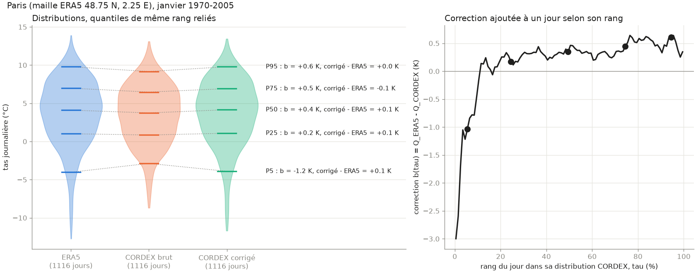
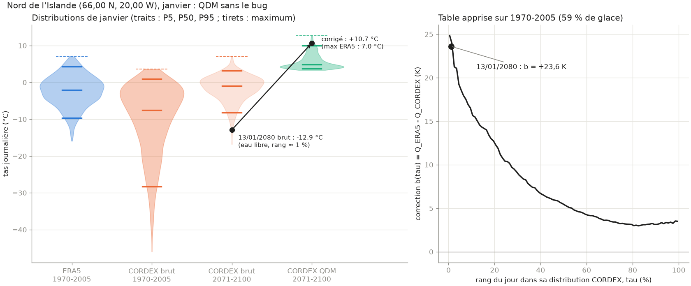

# Correction de CORDEX par ERA5

Correction de biais des 14 variables CORDEX (EUR-11, ICHEC-EC-EARTH r12i1p1 / SMHI-RCA4, `historical` puis `rcp_4_5`) contre la réanalyse ERA5, pour 1970-2100. Code dans `src/correction/`.

Ce document décrit la correction de EC-EARTH / RCA4, celle que sert le site. Ce couple sera remplacé par MPI-ESM1-2-HR / ICON-CLM (EUR-12, SSP3-7.0, `docs/choix_modele_cmip6.md`), téléchargé le 7/10/2026. La même chaîne lui a été appliquée les 7 et 8/10/2026, calibrée sur 1970-2014 : section 10. Les sections 1 à 9 décrivent RCA4, sauf mention contraire.

Chaîne : remappage (`remap.py`), correction par quantiles (`qdm.py`), variables dérivées (`derive.py`), contrôles (`check.py`, `spells.py`, `violin.py`), scores de distribution et de cohérence spatiale (`scores.py`).

## 1. Principe

### Remappage vers la grille ERA5

CORDEX (0,11°, grille en pôle tourné) est ramené sur la grille ERA5 (0,25°). Chaque maille ERA5 prend la moyenne des mailles CORDEX qui la recouvrent, pondérée par la surface de recouvrement. Les mailles ERA5 couvertes à moins de 90 % par le domaine CORDEX sont laissées vides.

`python -m src.correction.remap <variable> 1970-2100`

La variable d'environnement `WSA_MODEL` choisit la simulation (`src/correction/models.py`) : `rca4` par défaut, `mpi` pour MPI / ICON. Elle vaut pour toute la chaîne (`remap`, `qdm`, `land`, `derive`, `check`, `scores`, `spells`, `land_check`, `diagnostic`). Les deux simulations ont la même grille en pôle tourné : les poids de remappage servent aux deux.

### Quantile delta mapping (QDM)

Méthode de Cannon et al. (2015), appliquée séparément pour chaque maille et chaque mois calendaire.

**Calibration, une fois pour toutes, sur 1970 à la dernière année `historical` de la simulation** (1970-2005 pour RCA4, 1970-2014 pour MPI / ICON ; `CAL` dans `qdm.py`). Pour un mois donné (par exemple janvier), on prend tous les jours de ce mois sur 36 ans, soit environ 1 100 jours. On calcule 100 quantiles de la distribution ERA5 (Q_ERA5) et 100 quantiles de la distribution CORDEX (Q_CORDEX).

Q(τ) est la valeur sous laquelle se trouvent une proportion τ des jours. On compare donc des valeurs de quantiles, pas des moyennes.

**Application, pour chaque année de 1970 à 2100.** Pour corriger janvier de l'année Y :

1. on prend la fenêtre de 30 ans Y−15 à Y+14 (bornée à 1970-1999 au début et à 2071-2100 à la fin), en CORDEX brut seulement ;
2. pour chaque jour de janvier Y de valeur x, on calcule son rang τ parmi les janviers CORDEX de cette fenêtre ;
3. on corrige x selon la forme de la variable :
   - additive : x + b(τ), avec b(τ) = Q_ERA5(τ) − Q_CORDEX(τ) ;
   - multiplicative : Q_ERA5(τ) × x / Q_CORDEX(τ), les deux quantiles interpolés séparément, le changement du modèle x / Q_CORDEX(τ) plafonné à 10. Là où Q_CORDEX(τ) = 0 (nuit polaire), x est gardé ;
   - occurrence puis intensité (`pr`) : avant le calcul du rang, les jours sous un seuil propre au modèle, calé pour reproduire la fréquence des jours secs d'ERA5, deviennent secs ; les autres reçoivent la forme multiplicative, avec un rang et des quantiles calculés sur les seuls jours de pluie. Détail en section 2.
   - moyenne seule (`ps` et `zg500`, décembre à mars) : x + moyenne ERA5 − moyenne CORDEX sur la calibration, la même pour tous les rangs (section 5).

ERA5 n'intervient que dans la calibration. La fenêtre glissante sert seulement à situer chaque jour dans le climat du modèle à son époque. Un jour de rang 20 % reçoit la même correction en 1987 et en 2080, même s'il est plus chaud en 2080 : l'évolution simulée par le modèle, quantile par quantile, est conservée, comme différence ou comme rapport.

Entre deux quantiles, τ et la correction sont interpolés linéairement. Sous 0,5 % et au-dessus de 99,5 %, on applique la correction du quantile extrême. Valeurs égales (0 % ou 100 % de `clt`, 0 de `rsds`) : rang du milieu de leur groupe. Les valeurs corrigées sont ensuite ramenées dans les bornes physiques de la variable.

`python -m src.correction.qdm <variable>`

Avec `WSA_QDM_TEST=1`, `qdm`, `check`, `spells` et `violin` écrivent et lisent dans `eur11_025_qdm_test/` et `data/correction/test/`, sans toucher aux fichiers définitifs.

## 2. Particularités par variable

Table `VARS` de `src/correction/qdm.py`.

| CORDEX | ERA5 | Conversion | Forme | Bornes |
|---|---|---|---|---|
| `tas`, `tasmax`, `tasmin` | `t2m`, `mx2t`, `mn2t` | aucune | additive | |
| `pr` | `tp` (m/j) | ×1000/86400 | occurrence, puis multiplicative sur les jours de pluie | ≥ 0 |
| `hurs` | `hurs` | aucune | additive | 0 à 100 |
| `clt` | `tcc` (0 à 1) | ×100 | additive | 0 à 100 |
| `sfcWind` | `si10` | aucune | multiplicative | ≥ 0 |
| `rsds` | `ssrd` (J/m², cumul du jour) | /86400 | multiplicative | ≥ 0 |
| `rlds` | `strd` | /86400 | additive | ≥ 0 |
| `ps` | `sp` | aucune | additive ; moyenne seule de décembre à mars | |
| `evspsbl` | `e` (m, négatif pour l'évaporation) | ×(−1000/86400) | additive | |
| `zg500` | `zg500` | aucune | additive ; moyenne seule de décembre à mars | |
| `psl` | `msl` | aucune | moyenne seule toute l'année (isobares des cartes ; MPI / ICON seulement) | |
| `alb` = `rsus`/`rsds` | (`ssrd` − `ssr`)/`ssrd` | division par max(`rsds`, 1 W/m²) des deux côtés | additive | 0 à 1 |

Tx reste calé sur `mx2t`. Le maximum horaire de `t2m`, plus proche des stations, demanderait un nouveau téléchargement.

### Précipitations : occurrence puis intensité

Adaptation de fréquence de Themeßl et al. (2012), reprise dans xclim/xsdba, puis QDM sur les jours de pluie. Fonctions `calibrate` et `correct` de `qdm.py`, reprises par `check.py` et `violin.py`. Aucun tirage au hasard.

1. Occurrence. Pour chaque maille et chaque mois, sur 1970-2005 : seuil du modèle = valeur qui laisse sous elle la même proportion de jours que la proportion de jours secs (< 1 mm) d'ERA5. Le même seuil sert de 1970 à 2100 : l'évolution du nombre de jours de pluie du modèle est conservée.
2. Sous le seuil, jour sec. Les jours qui basculent sont choisis selon leur quantité. Ils reçoivent la bruine d'ERA5 (ses jours sous 1 mm) par correspondance de quantiles sur la calibration, sans delta : un jour sec du modèle prend la valeur d'ERA5 de même rang parmi les jours secs. Ils restent sous 1 mm ; le cumul garde l'apport de la bruine (4 à 6 % du cumul d'ERA5 sur l'Europe terre). Décidé le 9/10/2026 ; les fichiers de RCA4, corrigés avant, ont des jours secs à 0 (section 5).
3. Intensité : QDM multiplicatif entre les jours du modèle au-dessus du seuil (fenêtre de 30 ans pour le rang) et ceux d'ERA5 ≥ 1 mm, quantiles calculés sans les jours secs.
4. Moins de 30 jours pluvieux sur 1970-2005 dans ERA5 ou dans le modèle, pour une maille et un mois : occurrence corrigée, quantités laissées brutes (juillet : 9 398 mailles, Sahara et Moyen-Orient).
5. Modèle trop sec (plus de jours à 0 exact qu'ERA5 n'a de jours secs, environ 230 mailles désertiques en janvier et juillet) : seuil = plus petite valeur positive. Tous les jours de pluie du modèle sont gardés ; l'occurrence reste trop basse.

La table `pr_quantiles_<CAL>.nc` contient en plus le seuil (`threshold`), le nombre de jours pluvieux d'ERA5 et du modèle (`n_ref`, `n_hist`) et, depuis le 9/10/2026, les quantiles des jours secs (`dry_ref`, `dry_hist`).

### Variables dérivées

Calculées après le QDM par `python -m src.correction.derive <étape>` :
- `tn_tx` : `tasmax` et `tasmin` sont corrigés séparément ; les jours où Tn > Tx, les deux valeurs sont échangées. `tas` ne sera pas affiché dans l'application ;
- `huss` : recalculé à partir de `hurs`, `tas` et `ps` corrigés, avec la formule d'ERA5 (Tetens, sur l'eau). Sur ERA5 1970, cette formule appliquée aux moyennes journalières donne +1 % en moyenne et +11,5 % au P99 par rapport au `huss` d'ERA5, calculé heure par heure ;
- `rsus` = `rsds` corrigé × `alb` corrigé, pour que `rsus` ne dépasse jamais `rsds`.

## 3. Exemple : Paris, `tas`, janvier 1970-2005

- Les moyennes brutes sont presque égales : 3,69 °C pour ERA5, 3,52 °C pour CORDEX. Une correction de la moyenne ajouterait +0,17 K à tous les jours.
- Les formes diffèrent : CORDEX n'a presque pas de queue froide (minimum −8,7 °C contre −12,7 °C). Il est trop chaud de 1,2 K au P5, et trop froid de 0,2 à 0,6 K au-dessus du P25.
- b(τ) refroidit donc les jours froids (jusqu'à −3 K pour le 1 % le plus froid) et réchauffe les autres de 0,2 à 0,6 K.
- Après correction, l'écart à ERA5 est de −0,1 à +0,1 K du P5 au P95. Le minimum corrigé est −11,7 °C, contre −12,7 °C pour ERA5.

L'écart résiduel aux extrêmes a deux causes. D'une part, chaque année est classée dans sa propre fenêtre de 30 ans, pas dans 1970-2005. D'autre part, les quantiles extrêmes reposent sur une dizaine de jours.

Autres figures : `figures/correction/<variable>_paris_{01,07}_violin.png` pour `tasmax`, `tasmin`, `hurs` et `pr`. Pour `pr`, la courbe de droite porte sur le rang parmi les jours de pluie. Deux cas extrêmes de `pr` en janvier : `pr_coni_01_violin.png` (44,5 N 7,5 E), modèle bien trop sec, facteur de 3 à 80 selon le rang ; `pr_foret-noire_01_violin.png` (48,25 N 8,25 E), modèle deux fois trop pluvieux, facteur de 0,45 à 0,6.

`python -m src.correction.violin <variable> 48.86 2.35 <mois> Paris`

## 4. Validation

### Calibration, validation, production de la correction

La méthode est appliquée deux fois, avec les mêmes étapes, sur deux périodes de calibration différentes. On obtient deux tables différentes.

Une table contient, pour chaque maille et chaque mois, les 100 quantiles d'ERA5 et de CORDEX sur la période de calibration, donc la correction de chaque quantile. Exemple, Paris, janvier, `tas`, calibration 1970-2005 : on range les 1 116 jours de janvier de 1970 à 2005 du plus froid au plus chaud, dans ERA5 et dans CORDEX ; au P5, CORDEX est trop chaud de 1,2 K, la table retire donc 1,2 K au P5.

| | Table de production | Table de test |
|---|---|---|
| Calibration | 1970-2005 (36 ans, environ 1 100 jours par mois) | 1970-1987 (18 ans, environ 560 jours par mois) |
| Corrige | 1970-2100 | 1988-2005 |
| Comparée à | rien : pas d'ERA5 après 2005 | ERA5 1988-2005, que la calibration n'a pas vu |
| Enregistrée | `<variable>_quantiles_1970-2005.nc`, fichiers corrigés `eur11_025_qdm/` | non, recalculée en mémoire par `check.py` et `scores.py` |
| Rôle | données de l'application | juger la méthode |

Pourquoi deux tables : sur ses propres années de calibration, la correction reproduit ERA5 par construction (`pr`, janvier 1970-1987, Europe terre : 39,3 % de jours de pluie dans ERA5 et dans le corrigé). Ce résultat ne dit rien des années non vues. La table de test, calibrée sur 1970-1987, est donc jugée sur 1988-2005, qui joue le rôle du futur.

Conséquences :
- les résultats du test sont un peu pessimistes : 18 ans de calibration au lieu de 36, donc plus de bruit d'échantillonnage dans la table ;
- la table de production, sur 36 ans, est testée sur 2006-2024 contre E-OBS, des stations indépendantes d'ERA5 (voir « Validation contre E-OBS »).

### Contrôles

`python -m src.correction.check <variable>`, sorties dans `data/correction/check_<variable>.log` et `<variable>_validation.png`.

- **Validation croisée.** Calibration sur 1970-1987, correction et comparaison à ERA5 sur 1988-2005 : biais moyen, P5 et P95 par mois, moyenne et RMS entre mailles.
- **Conservation du signal.** Écart 2071-2100 contre 1976-2005, avant et après correction, en différence (forme additive) ou en % (multiplicative).
- **Bornes.** Fréquence des jours secs pour `pr`, part de jours aux bornes pour les variables bornées.
- **Indices** sur 1988-2005, année par année : jours > 25 et > 30 °C, Tx maximal, plus longue série > 30 °C ; nuits tropicales, jours de gel, Tn minimal, plus longue série de gel ; cumul annuel, jours ≥ 1 mm, pluie maximale en 1 et 5 jours, plus longue série sèche, durée moyenne des séries sèches ; persistance jour à jour (corrélation des anomalies au mois) pour toutes les variables.
- **Séries sèches** par saison et par région, 1970-2005 : `python -m src.correction.spells`.

Pour `huss` et `rsus`, dérivées de champs calibrés sur 1970-2005, `check` compare les fichiers finaux à ERA5 sur 1988-2005 : ce n'est pas une validation indépendante.

### Synthèse

Validation croisée, écart au ERA5 sur 1988-2005, moyenne mensuelle ; plage sur les 12 mois.

| Variable | Biais moyen brut | Biais moyen corrigé | RMS entre mailles, brut → corrigé | Signal conservé (moyenne du domaine) |
|---|---|---|---|---|
| `tas` | −1,1 à −2,5 K | −0,6 à +0,2 K | 1,8-3,3 → 0,5-1,7 K | à 0,01 K |
| `tasmax`, `tasmin` | −0,6 à −2,8 K | −0,75 à +0,2 K | | à 0,02 K |
| `hurs` | | +0,5 à +1 % d'avril à septembre | 6-7 → 2-2,8 % | oui |
| `pr` | voir ci-dessous | | | voir ci-dessous |
| `clt` | −4,2 à −7,6 % | −0,3 à +2,5 % | 7,5-13,9 → 3,0-6,5 % | à 0,15 point |
| `sfcWind` | +0,47 à +0,77 m/s | −0,35 à +0,09 m/s | 0,8-1,3 → 0,3-0,7 m/s | à 0,05 point de % |
| `rsds` | +5 à +18 W/m² | −6,8 à −0,3 W/m² | 9-27 → 2-10 W/m² | à 0,3 point de % |
| `rlds` | −5,4 à −10,8 W/m² | −1,0 à +2,7 W/m² | 9-15 → 3,5-8,4 W/m² | à 0,1 W/m² |
| `ps` | −0,9 à +1,4 hPa | −1,2 à +2,2 hPa | 3,6-5,0 → 0,8-6,6 hPa | à 0,02 hPa |
| `evspsbl` | +0,12 à +0,32 mm/j | −0,20 à +0,08 mm/j | 0,4-0,8 → 0,2-0,5 mm/j | à 0,01 mm/j |
| `zg500` | −35 à −56 m | −15 à +16 m | 37-64 → 13-61 m | à 0,5 m |
| `alb` | +0,01 à +0,04 | 0 à +0,01 | 0,04-0,11 → 0,01-0,04 | à 0,01 |
| `huss` (non indépendant) | −0,3 à −1,4 g/kg | −0,01 à +0,16 g/kg | 0,5-1,9 → 0,1-0,3 g/kg | à 1 point de % |
| `rsus` (non indépendant) | +2 à +8 W/m² | −0,25 à +0,24 W/m² | 6-18 → 0,5-2,2 W/m² | à 1 à 3 points de % |

Persistance jour à jour : inchangée par la correction pour toutes les variables. Seule exception notable, sans lien avec la correction : `alb`, 0,56 pour ERA5, 0,75 brut, 0,71 corrigé (section 5).

`ps`, `zg500` : les biais corrigés de février (+2,2 hPa, +16 m) viennent de la variabilité d'ERA5 entre les deux périodes (section 5).

### Scores : distance aux distributions et cohérence spatiale

`python -m src.correction.scores <variable> [lat0 lat1 lon0 lon1]`, sorties dans `data/correction/scores_<variable>.log` et `<variable>_scores.png`. Même validation croisée que `check` ; pour `huss` et `rsus`, fichiers finaux (non indépendant).

**Distance aux distributions.** Pour chaque maille et chaque mois, distance de Wasserstein W1 = moyenne sur τ de |Q_A(τ) − Q_B(τ)| : l'écart moyen entre quantiles de même rang, dans l'unité de la variable. W1 entre ERA5 1988-2005 et, successivement, CORDEX brut et corrigé. Plancher : W1 entre ERA5 1970-1987 et ERA5 1988-2005, soit ce qui sépare déjà deux périodes de 18 ans du climat réel (variabilité et tendance). Une correction calibrée sur 18 ans ajoute son propre bruit d'échantillonnage : un corrigé entre 1 et 1,5 fois le plancher est un bon résultat (estimation, non calculée). Pour `pr`, W1 porte sur les jours ≥ 1 mm, s'il y en a au moins 30 dans chaque échantillon.

Europe terre (35 N et plus, 10 W à 40 E, `lsm` ≥ 0,5, 16 633 mailles), médiane sur les mailles, moyenne des 12 mois :

| Variable | Plancher | Brut | Corrigé | Mailles au plancher, brut → corrigé |
|---|---|---|---|---|
| `tas` | 0,97 K | 2,21 | 0,99 | 17 → 47 % |
| `tasmax` | 1,01 K | 1,72 | 1,09 | 27 → 43 % |
| `tasmin` | 0,90 K | 2,52 | 0,88 | 12 → 49 % |
| `alb` | 0,011 | 0,048 | 0,011 | 8 → 50 % |
| `rsds` | 4,8 W/m² | 20,6 | 6,2 | 6 → 25 % |
| `rlds` | 3,8 W/m² | 13,5 | 4,9 | 3 → 31 % |
| `sfcWind` | 0,13 m/s | 0,71 | 0,18 | 11 → 26 % |
| `evspsbl` | 0,08 mm/j | 0,28 | 0,10 | 14 → 34 % |
| `clt` | 3,0 % | 10,5 | 4,0 | 9 → 25 % |
| `hurs` | 1,4 % | 4,6 | 1,9 | 11 → 30 % |
| `zg500` | 21 m | 39 | 27 | 21 → 36 % |
| `ps` | 1,5 hPa | 2,3 | 1,9 | 29 → 28 % |
| `pr`, jours de pluie | 0,50 mm/j | 0,74 | 0,73 | 29 → 20 % |
| `huss` (non indépendant) | 0,25 g/kg | 0,59 | 0,22 | 20 → 59 % |
| `rsus` (non indépendant) | 1,2 W/m² | 7,8 | 0,9 | 4 → 71 % |

- Sauf `ps`, `zg500` et `pr`, la correction ramène W1 près du plancher, dans toutes les régions (Europe mer, nord de 60 N, sud de 35 N) ; au sud de 35 N, le corrigé passe souvent sous le plancher, ERA5 y variant peu d'une période à l'autre.
- `ps`, `zg500` : bons en été (`zg500`, juin : brut 54 m, corrigé 17 m, plancher 13 m), dégradés en hiver (section 5).
- `pr` : pas de gain sur l'intensité en moyenne sur l'Europe (section 5). Fréquence des jours de pluie, écart absolu médian à ERA5, Europe terre : janvier plancher 5,2, brut 7,3, corrigé 6,3 points ; octobre 2,5, 4,5, 3,8.

**Cohérence spatiale.** Chaque maille est corrigée seule : la correction pourrait rendre deux voisines moins semblables un jour donné. Anomalies journalières (à la moyenne de chaque maille et de chaque mois), corrélées dans le temps entre chaque maille et ses voisines à 1, 2, 4 et 8 mailles (28 à 220 km), vers l'est et vers le nord, par saison. Pour `pr`, en plus, l'occurrence des jours de pluie.

- La correction ne dégrade la cohérence pour aucune variable : brut et corrigé à ±0,02. Exceptions : `pr` au sud de 35 N au printemps, à 8 mailles, 0,42 brut, 0,34 corrigé ; `alb` en été, 0,34 et 0,29.
- Les écarts à ERA5 viennent du modèle. Exemples à 8 mailles, Europe terre : `pr` en hiver, ERA5 0,72, brut 0,61, corrigé 0,60 ; `tasmin` en été, 0,86, 0,70, 0,71 ; `alb` en été, 0,54, 0,34, 0,29. ERA5, de résolution effective plus grossière, est probablement plus lisse que le modèle, ce qui explique une partie de ces écarts.

### Températures

| Indice, 1988-2005, moyenne sur le domaine | ERA5 | brut | corrigé | RMS entre mailles, brut → corrigé |
|---|---|---|---|---|
| jours Tx > 30 °C par an | 20,0 | 17,9 | 18,7 | 8,9 → 3,6 |
| plus longue série Tx > 30 °C (j) | 12,7 | 10,5 | 11,8 | 8,5 → 3,5 |
| nuits tropicales par an | 26,5 | 14,5 | 24,5 | 24,7 → 4,8 |
| jours de gel par an | 73,0 | 90,0 | 73,2 | 26,0 → 6,1 |
| persistance jour à jour (Tx) | 0,75 | 0,76 | 0,75 | inchangée |

Signal : au P95, écart brut/corrigé jusqu'à 7,9 K en hiver, dans les mailles de neige et de glace (section 5).

### Précipitations

| Indice, 1988-2005 | ERA5 | brut | corrigé | RMS entre mailles, brut → corrigé |
|---|---|---|---|---|
| cumul annuel (mm) | 779 | 827 | 774 | 201 → 73 |
| jours ≥ 1 mm par an | 140,4 | 141,9 | 142,9 | 21,5 → 7,5 |
| plus longue série sèche (j) | 47,0 | 38,0 | 47,3 | 31,8 → 9,9 |
| durée moyenne des séries sèches (j) | 12,4 | 7,3 | 14,4 | 20,6 → 12,9 |

- Durée moyenne des séries sèches, médiane sur les mailles, Europe terre : ERA5 3,2 à 3,7 j selon la saison, corrigé 3,0 à 3,6 j. L'écart sur le domaine vient des déserts (section 5).
- Signal, juin : 824 mailles dont le signal est décalé de plus de 10 points, 7 de plus de 20. Alpes maritimes (44,5 N 7,25 E) : brut +51 %, corrigé +79 %. Nord-est de la Turquie (40,5 N 41,25 E) : +43 %, +75 %.
- Jours qui basculent (1970-2005) : environ 6 % des jours en médiane, 16 à 17 % au P95 des mailles. Ce sont des jours gris : en juillet, anomalie d'humidité brute de +2,9 à +3,5 % et d'amplitude Tx − Tn de −0,4 à −0,6 K, entre les jours secs (−2,3 %, +0,3 K) et les jours pluvieux (+4,8 %, −0,7 K).
- Jours de pluie corrigés sous 1 mm : 0,1 à 0,2 % des jours de pluie. Pas de plancher.

Sorties : `check_pr.log`, `pr_spells.log`, `pr_analyse.log` (signal en montagne, jours qui basculent, mailles sèches), `pr_series_seches.log`.

### Validation contre E-OBS

`python -m src.correction.eobs <variable>`, sorties dans `data/correction/<variable>_eobs.log` et `<variable>_eobs.png` (cartes du biais de la moyenne, janvier et juillet). 2 min 30 s par variable.

E-OBS v33.0e (KNMI, ECA&D) : analyse sur grille des stations européennes, 0,25°, 1950-2025, téléchargée par `python -m src.download.eobs`. Sept variables comparables : `tas`, `tasmax`, `tasmin`, `pr`, `hurs`, `sfcWind` (à partir de 1980), `rsds`. Les autres n'existent pas dans E-OBS (`pp` est réduite au niveau de la mer, non comparable à `ps`).

Méthode :
- chaque maille ERA5 reçoit la moyenne des 4 mailles E-OBS qui l'entourent (grilles décalées d'une demi-maille), si au moins 3 sont valides ce jour-là ;
- les jours manquants dans E-OBS sont retirés d'ERA5 et de CORDEX à la même date ; une maille compte pour un mois si E-OBS en a au moins 80 % des jours ;
- seules les distributions sont comparées, par maille et par mois : CORDEX ne suit pas la météo réelle au jour le jour ;
- A, 1970-2005 : ERA5, brut et corrigé contre E-OBS. Le corrigé reproduit ERA5 par construction ; A mesure l'écart entre ERA5, cible de la correction, et les stations. Plancher : E-OBS d'une moitié des années, tirées au hasard, contre l'autre moitié (un découpage chronologique ajoutait le réchauffement de A, +1 à +1,9 K) ;
- B, 2006-2024 : brut et corrigé contre E-OBS, années jamais vues par la correction. Pas d'ERA5 ni de plancher. L'écart mêle l'erreur de la correction, l'écart ERA5/E-OBS (lu sur A), l'erreur de tendance du modèle et 19 ans de variabilité naturelle.

Régions retenues : Europe terre et nord de 60 N. Écartés : la mer (139 mailles côtières, estimées à partir de stations à terre) et le sud de 35 N (réseau de stations clairsemé et changeant : environ 2 000 mailles valides sur A, 735 sur B ; Tx de juillet baisse de 3,5 K entre A et B sur les mailles communes). Sous-ensemble à faible dispersion de l'ensemble E-OBS (`tasmax`, `tasmin`, `pr` : la moitié des mailles les plus sûres) : mêmes conclusions.

Europe terre, biais de la moyenne (modèle moins E-OBS), plage sur les 12 mois :

| Variable | A : ERA5 | B : brut | B : corrigé |
|---|---|---|---|
| `tas` (K) | +0,05 à +0,3 | −0,6 à −3,3 | −1,3 à +0,6 |
| `tasmin` (K) | −0,15 à +0,9 | −0,5 à −3,8 | −1,2 à +0,8 |
| `tasmax` (K) | −0,55 à −1,2 | −0,8 à −4,1 | 0 à −2,2 |
| `hurs` (%) | −1,3 à +0,9 | −1,1 à +7,9 | −0,6 à +1,5 |
| `sfcWind` (m/s) | +0,3 à +0,7 | +1,1 à +2,0 | +0,3 à +0,8 |
| `rsds` (W/m²) | −2 à +15 | +13 à +29 | −8 à +6 |
| `pr`, jours ≥ 1 mm (points) | +3 à +9 | +3 à +11 | +0,5 à +12,5 |
| `pr`, cumul (%, médiane) | +15 à +38 | +12 à +59 | 0 à +42 |

Lecture :
- Sur A, le corrigé reproduit ERA5, sauf le cumul de `pr` : +8 à +29 % au lieu de +15 à +38 %, la bruine étant mise à 0 (section 5).
- ERA5 est trop froid sur Tx (−0,55 à −1,2 K), trop venteux (+0,3 à +0,7 m/s), trop pluvieux (+15 à +38 %) et trop lumineux hors été. Le corrigé en hérite. Au-delà du plancher (W1 de Tx : ERA5 1,0 à 1,3 K contre 0,4 à 0,8 K d'avril à septembre), l'écart est réel et pas seulement de l'échantillonnage.
- Sur B, la correction divise les biais du brut par 3 à 5. Elle tient hors de l'échantillon de calage.
- Défaut de tendance : en été, Tx corrigé −1,75 à −2,2 K et `rsds` −8 W/m², contre −1,2 K et −2 W/m² pour ERA5 sur A. Juillet : E-OBS se réchauffe de 1,35 K entre A et B, le modèle de 0,6 K. Voir la non-stationnarité de `rsds` (section 5). Fort en Europe de l'Est (−3 K en juillet).
- Novembre : −1,2 à −1,9 K sur les trois températures en B. Probablement de la variabilité naturelle (un seul membre), non vérifié.
- `pr`, B : cumul corrigé +39 à +42 % en mars et avril, contre +21 à +29 % sur A. Non analysé.
- Bruine (jours de 0,1 à 1 mm), A : E-OBS 4 à 6 % des jours, ERA5 24 à 31 %, corrigé 0. La bruine d'ERA5 est largement absente des stations.
- `hurs` : E-OBS perd environ 2 400 mailles valides entre A et B ; `rsds` : 10 000 à 12 500 mailles valides seulement.

## 5. Défauts connus

### Neige et glace (`tas`, `tasmax`, `tasmin`) : à traiter

Dans une partie des mailles, le modèle a une surface qu'ERA5 n'a pas, ou pas au même moment : banquise (nord de l'Islande, Barents, Botnie, mer Blanche), neige (Scandinavie, Russie du Nord, Alpes, Caucase). Les jours froids de CORDEX y sont trop froids de 15 à 25 K, alors que les jours chauds sont presque justes. La table b(τ) réchauffe alors fortement la queue froide. Quand le modèle perd cette glace ou cette neige dans le futur, cette correction s'applique à des jours qui ne sont plus sur de la glace ou de la neige.

Exemple, nord de l'Islande (66 N, 20 W), janvier, 2071-2100 contre 1976-2005 : P50 +6,8 K brut, +6,3 K corrigé ; P95 +2,5 K brut, +5,9 K corrigé. La table passe de +25 K pour les jours les plus froids à +3 K pour les jours médians, plus vite que la température du modèle ne monte : l'ordre des jours s'inverse (corrélation de rang brut/corrigé −0,43), et 24 % des jours de janvier 2071-2100 corrigés dépassent le maximum de janvier d'ERA5 (7,0 °C). Le 13/01/2080, −12,9 °C brut devient +10,7 °C.

Même maille sur 1970-2005, période de calibration : `tas_islande-nord_01_violin.png`.

Étendue : 6 247 mailles sur 53 573 ont, au moins un mois, un biais au P5 de plus de 10 K qui dépasse de plus de 7 K celui du P95 (seuils arbitraires). 1 393 en mer, 543 sur les côtes (`lsm` de 0,5 à 0,9), 4 311 sur terre, surtout en Russie du Nord (2 729) et en Scandinavie (1 517). Le problème est donc surtout celui de la neige sur terre.

C'est le défaut le plus gênant : il touche la zone d'intérêt et l'information principale. Pour l'instant, on garde le QDM et on marque ces mailles par l'indicateur de fiabilité (section 7). Essais sur la glace de mer : `docs/notes_correction_glace.md`.

### Déserts (`pr`) : accepté

L'écart sur la durée moyenne des séries sèches (14,4 j contre 12,4) vient entièrement des mailles à moins de 20 jours de pluie par an (sud de 35 N). Ailleurs, l'écart médian est de −0,2 j (Europe terre : 4,0 j contre 4,2). En validation croisée, le seuil y repose sur 4 ou 5 jours du modèle en 18 ans : à 26 N 0,25 E, ERA5 a 3 jours de pluie par an, le corrigé 0,2. Sur le calage complet : 0,40 % de jours de pluie en juillet contre 0,47 % ; 0,78 % en janvier contre 1,71 %. Dans les mailles à quantités brutes, un jour de pluie de juillet apporte 5,7 mm contre 2,9 mm dans ERA5, pour une moyenne mensuelle juste (0,03 mm/j).

Accepté : ERA5 est peu fiable dans ces déserts, situés en bordure du domaine. Ces mailles seront signalées par l'indicateur de fiabilité (critère immédiat : `n_ref` ou `n_hist` < 30).

### Amplification du signal de `pr` en montagne : accepté

Le signal relatif corrigé reste plus fort que le brut là où ERA5 est bien plus pluvieux que le modèle : Alpes maritimes en juin, +79 % contre +51 %. La version 2 donnait +154 % (section 6).

### Jours à 100 % de `clt` : à surveiller

La forme additive pousse les journées très couvertes au-delà de 100 %, ramenées à la borne. Part des jours à 100 % en validation croisée : ERA5 1,3 à 3,1 % selon le mois ; brut 0,0 à 0,2 % ; corrigé 4 à 10,3 % d'octobre à mars (maximum en janvier), 2,4 à 4,9 % d'avril à septembre. Biais moyen corrigé de +1 à +2,5 % en hiver. Piste possible, non décidée : forme multiplicative sur 100 − `clt`, ou correction par quantiles bornée.

### Non-stationnarité du biais : `rsds`, `hurs`

En validation croisée, `rsds` corrigé reste trop sombre de 4 à 7 W/m² d'avril à août : ERA5 s'éclaircit entre 1970-1987 et 1988-2005 par rapport au modèle. Explication probable, à vérifier : la baisse des aérosols en Europe (éclaircissement), que RCA4, à aérosols constants, ne représente pas (Boé et al. 2020, Schumacher et al. 2024). Le même mécanisme sous-estime le réchauffement estival du modèle, de 1,5 à 2 K en fin de siècle en RCP8.5 selon Boé et al. La correction ne peut pas le rattraper : elle conserve le signal du modèle. Confirmé contre E-OBS sur 2006-2024 (section 4, « Validation contre E-OBS »).

`hurs` : biais résiduel de +0,5 à +1 % d'avril à septembre, ERA5 s'asséchant sur terre entre les deux périodes, pas le modèle.

### `ps` et `zg500` en hiver : moyenne seule de décembre à mars

En validation croisée, la correction dégrade `ps` et `zg500` en hiver. `zg500`, Europe terre, W1 : février brut 35 m, corrigé 45 m, plancher 39 m ; mars 29, 45, 29 ; décembre 18, 28, 16. `ps`, février : 2,9, 3,8, 4,0 hPa. Ce sont les mois au plancher le plus haut : la circulation d'hiver d'ERA5 change entre 1970-1987 et 1988-2005 (probablement la phase positive de l'oscillation nord-atlantique de la fin des années 1980 et du début des années 1990, non vérifié). Le brut y est déjà au niveau du plancher ; la correction prend l'état de la circulation d'ERA5 en 1970-1987 pour un biais du modèle. Sur 1970-2005, la calibration définitive porte sur 36 ans et le défaut est probablement plus faible, mais de même nature.

Décision du 9/10/2026 : de décembre à mars, seule la moyenne est corrigée (`Var.mean_only` dans `qdm.py`) ; le reste de l'année, QDM complet. Effet pour MPI / ICON en section 10. Appliqué à MPI / ICON seulement : les fichiers de RCA4 n'ont pas été recalculés.

### Intensité de `pr` : pas de gain en moyenne, bruit de calibration

W1 sur les jours de pluie, Europe terre : le corrigé fait moins bien que le brut en hiver (janvier : plancher 0,47, brut 0,50, corrigé 0,61 mm/j), mieux en fin de printemps et en été (mai : 0,48, 0,95, 0,71). Le gain de la correction de `pr` vient de la fréquence des jours de pluie et de certaines zones (boîte 44-48 N, 4-10 E, janvier : 0,65, 1,46, 0,86). Cause vérifiée : le bruit d'échantillonnage de la calibration (environ 280 jours de pluie par maille sur 18 ans pour 100 quantiles). Mailles d'Europe terre classées selon l'intensité moyenne des jours de pluie du brut, rapportée à ERA5 1988-2005 ; W1 rapporté au plancher, médiane :

| Mois | Brut juste (0,9 à 1,1) : brut → corrigé | Brut biaisé (hors 0,9 à 1,1) : brut → corrigé |
|---|---|---|
| janvier | 8 852 mailles, 0,80 → 1,29 | 7 781 mailles, 1,5 à 2,0 → 1,15 à 1,50 |
| avril | 6 358, 0,94 → 1,38 | 10 275, 1,6 à 2,3 → 1,4 à 1,6 |
| juillet | 5 585, 1,07 → 1,51 | 9 734, 2,2 → 1,5 à 1,6 |
| octobre | 7 443, 1,02 → 1,47 | 9 138, 1,6 à 2,1 → 1,5 à 1,7 |

Le corrigé se place vers 1,3 à 1,6 fois le plancher quel que soit le brut : il améliore les mailles biaisées (61 à 74 % des mailles améliorées) et dégrade les mailles justes (16 à 24 % améliorées). Le 9e décile passe de 3,0-3,8 à 2,4-3,1 fois le plancher, la part des mailles au-delà de 2 fois le plancher de 21-40 % à 18-30 %. Janvier : Russie et Ukraine, brut juste (0,70 fois le plancher), corrigé 1,42 ; Alpes, 1,59 et 1,21. Script : `data/correction/pr_mailles.py` (non versionné).

La calibration définitive porte sur 36 ans, deux fois plus de jours : le bruit y est plus faible que dans ce test. Pistes, non décidées : calibrer chaque mois avec les mois voisins (fenêtre de 3 mois, trois fois plus de jours), réduire le nombre de quantiles, ne corriger l'intensité que là où le biais dépasse le bruit. Les autres variables sont probablement concernées dans une moindre mesure (`hurs`, `clt` : corrigé à 1,3 fois le plancher). Cartes : `pr_scores.png`.

### Bruine de `pr` supprimée : corrigée pour MPI / ICON

Les jours sous le seuil sont mis à 0 ; la bruine d'ERA5 (jours de 0 à 1 mm) n'est pas compensée. Europe terre, 1970-1987 (période de calibration de la table de test) :

| | Pluie moyenne (mm/j) | Jours ≥ 1 mm | Pluie par jour de pluie (mm) | Apport de la bruine (mm/j) |
|---|---|---|---|---|
| ERA5, janvier | 2,11 | 39,3 % | 4,88 | 0,14 |
| corrigé, janvier | 1,97 | 39,3 % | 4,89 | 0 |
| ERA5, juillet | 2,52 | 39,4 % | 5,77 | 0,11 |
| corrigé, juillet | 2,40 | 39,2 % | 5,84 | 0 |

Moyenne corrigée trop basse de 6,5 % en janvier, 4,5 % en juillet. Sur 1988-2005, le corrigé est au contraire trop pluvieux (janvier +13 %, juillet +4 %) : il garde l'évolution du modèle, qui gagne des jours de pluie quand ERA5 en perd.

Options étudiées : (1) multiplier les jours de pluie par le rapport cumul total / cumul des jours ≥ 1 mm d'ERA5, par maille et par mois ; (2) seuil à 0,1 mm, au risque de reproduire la bruine excessive des réanalyses (51 % des jours de janvier dans ERA5) ; (3) accepter ; (4) donner aux jours secs la bruine d'ERA5 par quantiles. Script : `data/correction/pr_signe.py` (non versionné).

Décision du 9/10/2026 : option 4 (section 2), appliquée à MPI / ICON ; l'option 1 a été essayée (section 6). Les fichiers de RCA4 gardent la bruine à 0.

### Persistance de `alb`

Corrélation d'un jour au suivant : ERA5 0,56, brut 0,75, corrigé 0,71. La surface du modèle varie moins d'un jour à l'autre que celle d'ERA5 ; la correction, qui agit sur les distributions, n'y change presque rien.

### Échange Tn/Tx

Le brut n'a aucun jour Tn > Tx ; la correction séparée en crée. 21 millions de valeurs échangées sur 1970-2100, de 0,4 % des jours-mailles au début à 1,1 % en 2100. En 1990 : écart médian 0,4 K, P99 4,4 K. Surtout dans les mailles mixtes terre-mer (îles de l'Égée, cap Corse, Minorque : jusqu'à 24 % des jours). Même phénomène observé dans la V1 avec la correction d'Open-Meteo.

### Signal de `rsds` et `rsus` en % dans la nuit polaire

En janvier et décembre, l'écart maximal brut/corrigé du signal relatif atteint des centaines, voire des milliers de % (`rsus` : 9 192 % en décembre), sur des mailles où le rayonnement est presque nul. Artefact du pourcentage sur des valeurs proches de 0, sans conséquence.

## 6. Essais non retenus

### `pr`, versions 1 et 2

1. Méthode de Cannon (2015) : valeurs sous 1 mm/j remplacées par des tirages au hasard entre 0 et 1 mm, rapport plafonné à 10, valeurs corrigées sous 1 mm mises à 0. Cumul annuel et jours de pluie corrigés, mais séries sèches raccourcies de 5 à 10 % partout : les jours secs à rendre pluvieux sont choisis au hasard et coupent les séries.
2. Tirages sur les zéros seulement, bruine gardée. Séries sèches réparées, mais signal amplifié en montagne : Alpes maritimes, juin, brut +51 %, corrigé +154 % ; 1 793 mailles décalées de plus de 10 points en juin, 65 de plus de 20. Cause : à un rang où le modèle passé n'a que de la bruine (0,1 mm) et ERA5 déjà 5 mm, un futur à 1,5 mm donne un changement de 15, plafonné à 10, soit 50 mm.

Un plancher sur le dénominateur a été envisagé, puis écarté. Comparaison des versions 2 et 3 :

| Indice, 1988-2005 | ERA5 | version 2 | version 3 (retenue) |
|---|---|---|---|
| cumul annuel (mm), RMS entre mailles | | 92 | 73 |
| jours ≥ 1 mm par an, RMS | | 11,6 | 7,5 |
| plus longue série sèche (j) | 47,0 | 45,2 | 47,3 |
| durée moyenne des séries sèches (j) | 12,4 | 11,8 | 14,4 |
| mailles décalées de plus de 10 / 20 points, juin | | 1 793 / 65 | 824 / 7 |

Sorties de la version 2 : `*_v2` dans `data/correction/`.

### Correction multivariée (MBCn)

MBCn (Cannon 2018) corrige plusieurs variables ensemble : QDM univarié de chaque variable, puis réordonnancement des jours pour reproduire les liens entre variables d'ERA5. Essai sur 5 mailles (Paris, Grenoble, Alpes 46,5 N 8 E, nord de l'Islande, Botnie), 6 variables : `tas`, amplitude diurne (`tasmax − tasmin`, avec `mx2t − mn2t` pour ERA5), `pr`, `hurs`, `sfcWind`, `rsds`. Réordonnancement à l'intérieur de chaque mois de chaque année, pour garder exactement la distribution univariée de l'année.

- Distributions et réchauffement : identiques à l'univarié, par construction.
- Liens entre variables (écart moyen des corrélations de rang à ERA5 sur 7 paires, validation croisée 1988-2005) : meilleurs dans 8 cas maille-saison sur 10, égaux dans 1, moins bons dans 1 (Paris en été). Gain le plus net aux Alpes en été (0,42 à 0,12).
- Persistance : l'autocorrélation de `tas` d'un jour au suivant baisse, jusqu'à 0,1 (Alpes en hiver : 0,69 à 0,59, ERA5 0,79). Le lien pluie/rayonnement s'affaiblit (Paris en été : −0,69 ERA5, −0,62 univarié, −0,42 MBCn).
- Coût : 0,14 s par transformation N-pdf, soit environ 140 jours de calcul sur un cœur pour le domaine avec le script d'essai ; à réduire par vectorisation et pas de 10 ans, non mesuré.
- Aux Alpes, en été, CORDEX brut est à 0 °C contre 8,3 °C pour ERA5, et le lien température/rayonnement a le mauvais signe : signature probable d'une surface enneigée, à confirmer.

Pas de décision prise. Scripts : `data/correction/tests_mbcn/` (non versionnés).

### Nombre de quantiles de `pr` (MPI / ICON)

Pour réduire le bruit de calibration de l'intensité de `pr` (section 10), la validation croisée a été refaite avec 20 et 50 quantiles au lieu de 100. W1 corrigé sur les jours de pluie, Europe terre, médiane : 0,676 (100), 0,674 (50), 0,670 (20) mm/j, plancher 0,450. Aucun gain : le bruit vient de l'échantillon de calibration lui-même, pas du nombre de quantiles. 100 quantiles gardés.

### Facteur de bruine de `pr` (MPI / ICON)

Jours de pluie corrigés multipliés par le rapport cumul total / cumul des jours ≥ 1 mm d'ERA5, par maille et par mois (option 1 de la section 5). Validation croisée, Europe terre, 1992-2014 : cumul annuel 763 → 807 mm (ERA5 783), pluie maximale en 1 jour 32,2 → 34,2 mm (ERA5 28,5), W1 des jours de pluie en janvier 0,51 → 0,65 mm/j. Le défaut de cumul devient un défaut d'intensité. Remplacé par la bruine par quantiles (section 2), qui ne touche pas aux jours de pluie.

### Validation par tirage d'années au hasard

18 ans de calibration, 18 de validation, tirage répété, en plus du découpage chronologique : proposée, non retenue pour le moment.

## 7. Points ouverts

**Indicateur de fiabilité.** Le QDM transforme chaque jour par la courbe x → x + b(τ(x)). L'ordre des jours est respecté tant que cette courbe monte. On retient sa pente minimale, mesurée entre déciles pour ne pas réagir aux irrégularités de b(τ), pour chaque maille, chaque mois et chaque année (la fenêtre glissante change d'une année à l'autre).

| Pente minimale | Signification |
|---|---|
| ≈ 1 | correction douce |
| entre 0 et 1 | jours comprimés |
| < 0 | ordre des jours inversé (nord de l'Islande, janvier 2071-2100) |

Classes proposées, seuils à fixer : vert au-dessus de 0,5, orange de 0 à 0,5, rouge sous 0. Calcul à partir des tables de quantiles et des quantiles de chaque fenêtre, sans relire les séries journalières ; environ 84 Mo en classes. Première étape : cartes de la pente minimale par mois, pour 1976-2005 et 2071-2100, pour choisir les seuils. Pour `pr`, s'ajoutent les mailles-mois à moins de 30 jours de pluie. Usage dans l'application (masquage ou avertissement) à décider avec l'interface.

**Domaine Afrique.** Le Sahara sera au centre du domaine : le défaut des déserts (section 5) est à reprendre, par exemple avec un seuil calé sur plusieurs mois voisins.

**Bornes de `clt`.** Voir section 5.

**Reportés.** Le masque mer ; la vérification Tn < Tx au moment de servir une météo (filet de sécurité dans le back-end).

## 8. État

Au 28/09/2026 : les 14 variables et `alb` sont corrigées et contrôlées (`check` et `scores`). Au 29/09/2026 : 7 variables validées contre E-OBS sur 1970-2005 et 2006-2024. Au 02/10/2026 : `tas`, `tasmax` et `tasmin` corrigés et validés à 0,1° contre ERA5-Land (section 9). Restent les décisions de la section 5 (`ps` et `zg500` en hiver, intensité de `pr`, neige et glace).

MPI / ICON (section 10) : remappé le 7/10/2026 ; températures corrigées et validées à 0,1° le 8/10/2026 ; les 14 variables et `alb` corrigés à 0,25°, variables dérivées calculées, `check`, `scores` et `spells` faits le 8/10/2026. Décisions prises le 9/10/2026 (section 10) : `pr`, `ps`, `zg500` recorrigés, `huss` recalculé, contrôles refaits. `psl` remappé à 0,25° et corrigé (moyenne seule) pour les isobares. Restent la validation contre E-OBS à 0,25° et la bascule du site.

Longs calculs à lancer sous `caffeinate`, chargeur branché : sur batterie, le Mac se met en veille profonde, ce qui suspend le calcul et peut provoquer un message de disque mal éjecté. Durées observées : remappage 8 min par variable, QDM 32 à 43 min, `check` 4 à 8 min, `scores` 2 à 5 min. MPI / ICON (45 ans de calibration) : remappage 3,4 s par année à 0,25°, 9 s à 0,1° ; QDM 32 à 43 min à 0,25°, environ 1 h 40 par variable à 0,1° ; `check` 4 à 10 min, `scores` 3 à 8 min.

Les fichiers temporaires du QDM (10 Go à 0,25°, 56 Go à 0,1°) sont effacés à la fin, mais les instantanés locaux de Time Machine les retiennent : `tmutil thinlocalsnapshots / 300000000000 4` rend la place.

## 9. Températures à 0,1° contre ERA5-Land

`tas`, `tasmax` et `tasmin` sont aussi corrigés à 0,1°, contre ERA5-Land, pour garder le détail du relief que la grille à 0,25° lisse. Ce sont ces versions que sert l'application. Les autres variables, dont `hurs`, restent à 0,25° contre ERA5. Code dans `src/correction/land.py` et `land_check.py` ; la chaîne à 0,25° n'est pas modifiée.

### Référence : ERA5-Land

Téléchargé par `src/download/era5land.py` (Earth Data Hub, `reanalysis-era5-land-no-antartica-v0`), 1970-2025, à 0,1°, terres seulement. ERA5-Land ramène la température à 2 m à un relief plus fin qu'ERA5. Il ne fournit ni extrêmes journaliers ni humidité relative ; les champs journaliers sont calculés à partir des valeurs horaires (jours UTC, 00h à 23h) :

| Champ | Contenu | Variable corrigée |
|---|---|---|
| `t2m` | moyenne des valeurs horaires de `t2m` | `tas` |
| `t2mmax` | maximum des valeurs horaires de `t2m` | `tasmax` |
| `t2mmin` | minimum des valeurs horaires de `t2m` | `tasmin` |
| `d2m` | moyenne des valeurs horaires | non utilisé |
| `hurs` | moyenne des valeurs horaires, formule d'ERA5 | non utilisé |

Le Tx d'ERA5 (`mx2t`) est le maximum sur le pas de temps du modèle ; celui d'ERA5-Land, le maximum des valeurs horaires, un peu plus bas. Le Tx corrigé à 0,1° est donc un peu plus bas qu'à 0,25°, mais cohérent avec le passé affiché. Earth Data Hub arrondit les valeurs au pas de 0,25 K, comme pour ERA5.

Lecture par blocs natifs du serveur (120 jours × 64 × 64 mailles, alignés sur le 1er janvier 1950), pour que chaque bloc ne soit compté qu'une fois dans le quota : environ 58 000 lectures pour 1970-2024.

### Méthode

1. Remappage de CORDEX (0,11°, pôle tourné) vers la grille ERA5-Land, par la moyenne pondérée de la section 1 (SUB = 20). Une maille de 0,1° reçoit 1 à 2 mailles CORDEX. Mailles gardées : terre d'ERA5-Land et couverture CORDEX d'au moins 90 %, soit 173 046.
2. QDM identique à la section 1 (mêmes fonctions), forme additive, contre ERA5-Land 1970-2005. Les mailles sont traitées par paquets de 40 000 pour tenir en mémoire.
3. Échange Tn/Tx des jours où `tasmin` > `tasmax` : 92,2 millions de valeurs sur 1970-2100, soit 1,1 % des jours-mailles (0,8 % à 0,25°).

`python -m src.correction.land remap tasmax 1970-2100`, puis `qdm tasmax`, puis `swap` une fois `tasmax` et `tasmin` corrigés. Durées : remappage environ 12 s par année, QDM environ 1 h 35 par variable. Les fichiers remappés (`LaCie/.../cordex/eur11_010/`) ne servent qu'au QDM et à la validation croisée ; ils ont été supprimés une fois la validation faite, et `remap` les reconstruit en 30 min par variable.

### Validation

`python -m src.correction.land_check tasmax`, sur une maille de terre sur quatre (43 262 mailles). Journaux dans `data/correction/land/check_<variable>.log` et `eobs_<variable>.log`.

**Validation croisée contre ERA5-Land** (calibration 1970-1987, test 1988-2005). Même comportement qu'à 0,25° : biais moyen corrigé entre −0,6 et +0,4 K la plupart des mois (−1 à −4,4 K brut), résidu de −0,9 à −1,5 K en février et mars ; RMS entre mailles divisé par 2 à 6 ; W1 corrigé au niveau de son plancher.

**Signal** 2071-2100 contre 1976-2005 : conservé à moins de 0,1 K, en hiver comme en été.

**Contre E-OBS 0,1°, 2006-2024**, années non vues. Chaque maille ERA5-Land reçoit la moyenne des 4 mailles E-OBS qui l'entourent (centres décalés d'une demi-maille). L'erreur sur le détail local est mesurée par le RMS entre mailles du biais de la moyenne, sur la moitié des mailles où la dispersion de l'ensemble E-OBS est la plus faible :

| | Altitude | 0,1° | 0,25° |
|---|---|---|---|
| Tx janvier | 1000-1500 m | 1,73 | 1,86 |
| | > 1500 m | 2,54 | 2,87 |
| Tx juillet | < 500 m | 2,10 | 2,16 |
| | > 1500 m | 2,09 | 2,36 |
| Tn janvier | 500-1000 m | 1,47 | 1,62 |
| | > 1500 m | 2,96 | 3,55 |
| Tn juillet | 1000-1500 m | 1,33 | 1,51 |
| | > 1500 m | 1,74 | 2,09 |
| Tmoy janvier | 1000-1500 m | 1,46 | 1,75 |
| Tmoy juillet | 500-1000 m | 1,04 | 1,27 |
| | > 1500 m | 1,46 | 1,81 |

Le 0,1° est meilleur ou égal presque partout, avec un gain de 5 à 20 % qui croît avec l'altitude. Exceptions, d'un ou deux dixièmes : Tx de juillet à 1000-1500 m (2,30 contre 2,26 K), Tn de juillet sous 500 m (1,26 contre 1,19 K). Les moyennes par classe d'altitude, qui mêlent des biais de signes opposés, ne départagent pas les deux grilles.

Exemples à la maille du lieu, moyenne 2006-2024 :

| Lieu | | E-OBS | 0,1° | 0,25° |
|---|---|---|---|---|
| Grenoble | Tn janvier | −1,8 | −1,9 | −3,9 |
| Grenoble | Tx juillet | 26,7 | 24,6 | 22,8 |
| Briançon | Tx juillet | 20,6 | 19,0 | 16,7 |
| Briançon | Tn janvier | −7,3 | −9,9 | −12,4 |
| Clermont-Ferrand | Tx juillet | 26,4 | 24,0 | 23,2 |
| Pontarlier | Tx juillet | 23,4 | 21,8 | 22,7 |

**Limites.** E-OBS est interpolé en montagne, où les stations sont rares. La moyenne de 4 mailles E-OBS est trompeuse en vallée encaissée (Chamonix : 2456 m de moyenne pour une ville à 1035 m) et sur la côte (Marseille). Le biais froid du Tx de juillet en plaine, environ −1,9 K contre E-OBS, existe aux deux résolutions ; environ −1,2 K vient déjà d'ERA5 et d'ERA5-Land.

**`hurs` à 0,1°, non retenu.** Validation croisée moins bonne qu'à 0,25° en été (biais corrigé +1,8 à +2,4 points de mai à août, contre +0,5 à +1) ; aucun gain mesurable contre E-OBS, dont l'humidité est peu fiable en altitude (10 à 20 points d'erreur pour toutes les sources). La température humide est donc calculée avec `tas` à 0,1° et `hurs` à 0,25°.

## 10. MPI-ESM1-2-HR / ICON-CLM

Simulation retenue le 6/10/2026 (`docs/choix_modele_cmip6.md`). Même chaîne que RCA4, avec `WSA_MODEL=mpi`.

### Mise en œuvre

| | RCA4 | MPI / ICON |
|---|---|---|
| Fin de `historical` | 2005 | 2014 |
| Calibration (`CAL`) | 1970-2005 | 1970-2014 (45 ans) |
| Validation croisée | 1970-1987, puis 1988-2005 | 1970-1991, puis 1992-2014 |
| Contre E-OBS (années non vues) | 2006-2024 | 2015-2025 |
| Fichiers remappés | `eur11_025/`, `eur11_010/` | `eur12_mpi_025/`, `eur12_mpi_010/` (gardés) |
| Fichiers corrigés | `eur11_025_qdm/`, `eur11_010_qdm/` | `eur12_mpi_025_qdm/`, `eur12_mpi_010_qdm/` |
| Tables et journaux | `data/correction/` | `data/correction/mpi/` |

Les deux grilles sont identiques (412 × 424 mailles, pôle 39,25 N 162 W, coordonnées égales à 4e-15° près). Les fichiers ESGF, par blocs de 5 ans, sont lus année par année. Les fichiers remappés de MPI / ICON sont gardés : ils permettront de recalculer les quantiles de chaque fenêtre de 30 ans pour un éventuel ajustement sur la TRACC.

### Diagnostic du brut

`python -m src.correction.diagnostic bias <variable>` (contre ERA5 à 0,25°), `land <variable>` (contre ERA5-Land à 0,1°), `step` (marche au début du scénario). Sorties dans `data/correction/mpi/diagnostic/` : journal, statistiques par maille et par mois, cartes du biais de la moyenne en janvier, avril, juillet et octobre.

Biais brut, modèle moins référence, 1970-2014, moyenne sur les mailles :

| | Europe terre, janvier | Europe terre, juillet | France, janvier | France, juillet |
|---|---|---|---|---|
| Tx (0,1°) | −0,7 K | +0,9 K | +0,3 K | +0,6 K |
| Tn (0,1°) | −0,8 K | −0,4 K | +0,7 K | 0,0 K |
| `pr` | +3 % | −28 % | +18 % | −24 % |
| jours de pluie ≥ 1 mm | −1 pt | −8 pts | +2 pts | −8 pts |
| `hurs` | −3,6 pts | −3,4 pts | −4,7 pts | −0,6 pt |
| `rsds` | −6 % | −2 % | −8 % | −3,5 % |
| albédo | −0,06 | −0,02 | −0,06 | −0,03 |
| `zg500` | −30 m | +7 m | −15 m | +13 m |

Températures : hiver trop froid au nord-est (Russie, Finlande : Tx de janvier sous −4 K), Tx d'été trop chaud au sud-est (Balkans, Turquie, Afrique du Nord : au-delà de +4 K). Été trop sec. Albédo trop bas sur toutes les terres, même en été.

**Queue froide** (critère de la section 5) : 2 000 à 2 300 mailles à 0,25° selon la température, presque toutes en mer au nord de 60 N (banquise), 55 à 110 sur terre. À 0,1° : 580 à 710 mailles de terre, toutes au nord de 60 N. Le défaut de la neige sur terre, le plus gênant pour RCA4, devient marginal.

**Marche en 2015** (droite plus marche sur les moyennes annuelles 1995-2034) : seule `rsds` a une marche nette, −3,3 ± 1,9 W/m² sur l'Europe terre ; défaut des aérosols d'ICON, accepté (`docs/choix_modele_cmip6.md`, section 4).

**Comparaison au brut de RCA4**, même diagnostic sur 1970-2005 (`data/correction/comparaison_1970-2005/`). Erreur typique = RMS du biais sur les mailles et les 12 mois.

| France | RCA4 | MPI / ICON |
|---|---|---|
| `tas`, biais d'été | −2,6 K | −0,4 K |
| `tas`, erreur typique | 2,3 K | 0,8 K |
| Tx, erreur typique | 1,9 K | 0,8 K |
| Tn d'été, biais | −3,2 K | −0,1 K |
| `sfcWind`, biais d'hiver | +55 % | +8 % |
| `rsds`, biais d'hiver | +21 % | −13 % |
| `clt`, biais d'été | −12 pts | +3 pts |
| `pr`, biais d'été | +6 % | −18 % |
| `hurs`, biais d'hiver | +0,7 pt | −4,1 pts |

MPI / ICON brut est plus proche d'ERA5 sur presque toutes les variables ; il est moins bon sur la pluie d'été et l'humidité relative. Queue froide sur terre (`tas`) : 4 164 mailles pour RCA4, 110 pour MPI / ICON.

### Températures à 0,1° contre ERA5-Land

`WSA_MODEL=mpi python -m src.correction.land qdm tasmax`, puis `swap`, puis `land_check`. Journaux dans `data/correction/mpi/land/`. Échange Tn/Tx : 8,4 millions de valeurs, 0,1 % des jours-mailles (RCA4 : 1,1 %).

- **Validation croisée** (calibration 1970-1991, test 1992-2014) : biais moyen corrigé de −1,0 à +0,3 K selon le mois ; RMS entre mailles divisé par 1,5 à 4 (juillet : Tx 2,0 → 0,8 K, Tn 2,7 → 0,6 K) ; W1 au plancher ou dessous. Le corrigé reste trop froid de 0,4 à 0,55 K en été : ERA5-Land se réchauffe plus vite que le modèle entre les deux moitiés.
- **Signal** 2071-2100 contre 1976-2005 conservé à 0,05 K près : Tx +3,8 K en hiver, +3,5 K en été ; Tn +4,3 K et +3,3 K (moyenne des mailles de terre du domaine).
- **Contre E-OBS, 2015-2025**, plaine (< 500 m) : Tx −1,1 K en janvier, −1,3 K en juillet (ERA5-Land : −0,5 et −1,0 K) ; Tn 0,0 et +0,9 K (ERA5-Land : +0,3 et +1,2 K). L'écart du Tx d'été vient surtout d'ERA5-Land ; s'y ajoutent 0,3 à 0,6 K de retard du modèle sur le réchauffement récent. Paris, Tx moyen de juillet 2015-2025 : E-OBS 26,6 °C, ERA5-Land 25,1 °C, corrigé 23,8 °C.

### Toutes les variables à 0,25° contre ERA5

Journaux dans `data/correction/mpi/` (`qdm_*`, `derive_*`, `check_*`, `scores_*`, `pr_spells.log`). Échange Tn/Tx : 2,97 millions de valeurs.

Validation croisée (calibration 1970-1991, test 1992-2014), moyennes sur les 12 mois : |biais| moyen du domaine, RMS entre mailles, W1 médian sur l'Europe terre et son plancher (W1 entre ERA5 1970-1991 et ERA5 1992-2014). RCA4 corrigé, testé sur 1988-2005, entre parenthèses.

| | Unité | \|biais\| brut → corrigé | RMS brut → corrigé (RCA4) | W1 brut → corrigé (plancher) |
|---|---|---|---|---|
| `tasmax` | K | 0,54 → 0,43 | 1,47 → 0,87 (0,88) | 1,04 → 0,86 (0,86) |
| `tasmin` | K | 0,41 → 0,40 | 1,83 → 0,83 (0,82) | 1,02 → 0,73 (0,77) |
| `tas` | K | 0,67 → 0,46 | 1,44 → 0,85 (0,85) | 1,02 → 0,81 (0,86) |
| `pr` | mm/j | 0,12 → 0,07 | 0,59 → 0,51 (0,60) | 0,61 → 0,68 (0,46) |
| `hurs` | % | 1,47 → 0,53 | 4,30 → 1,85 (2,13) | 3,05 → 1,56 (1,50) |
| `huss` | g/kg | 0,40 → 0,04 | 0,61 → 0,20 (0,20) | 0,40 → 0,18 (0,23) |
| `clt` | % | 2,37 → 1,22 | 6,54 → 3,53 (4,11) | 4,62 → 3,26 (2,60) |
| `sfcWind` | m/s | 0,20 → 0,06 | 0,67 → 0,31 (0,37) | 0,46 → 0,16 (0,11) |
| `rsds` | W/m² | 6,0 → 1,1 | 10,2 → 5,2 (6,0) | 8,2 → 5,1 (5,0) |
| `rlds` | W/m² | 2,6 → 1,2 | 9,3 → 4,3 (5,0) | 5,3 → 3,9 (3,4) |
| `rsus` | W/m² | 1,9 → 0,4 | 6,4 → 1,3 (1,2) | 5,0 → 1,0 (1,1) |
| `alb` | | 0,01 → 0,01 | 0,05 → 0,02 (0,02) | 0,04 → 0,01 (0,01) |
| `ps` | hPa | 0,65 → 0,52 | 4,0 → 1,8 (2,5) | 2,2 → 1,6 (1,2) |
| `evspsbl` | mm/j | 0,09 → 0,06 | 0,53 → 0,28 (0,28) | 0,17 → 0,08 (0,08) |
| `zg500` | m | 13,7 → 7,9 | 27,2 → 24,7 (29,9) | 26,9 → 24,3 (19,6) |

`huss` et `rsus` sont recalculés à partir de champs calibrés sur 1970-2014 : leur validation n'est pas indépendante. `pr`, `ps` et `zg500` avec les décisions du 9/10/2026 (bruine par quantiles, moyenne seule de décembre à mars).

Signal 2071-2100 contre 1976-2005 conservé : 0,06 K au plus pour les températures, moins de 0,2 % pour `sfcWind`, `hurs`, `rlds`. Exceptions : `pr` (ci-dessous) ; `rsds` et `rsus` en décembre, dans la nuit polaire (section 5).

### Précipitations

**Fréquence.** Le modèle est trop sec en été : le seuil du modèle (section 2) descend sous 1 mm. Europe terre, seuil médian : 0,93 mm en janvier, 0,50 en juillet, 0,56 en août ; en France, 0,35 mm en août. Sous ce seuil, les jours deviennent secs et reçoivent la bruine d'ERA5 ; au-dessus, des jours de bruine du modèle deviennent des jours de pluie. Aucune maille d'Europe terre n'a plus de jours à 0 exact qu'ERA5 n'a de jours secs. Jours secs de juillet en validation croisée : ERA5 69,9 %, brut 75,5 %, corrigé 69,6 %. Durée moyenne des séries sèches d'été, Europe terre : ERA5 3,1 j, brut 3,4 j, corrigé 3,1 j.

**Cumul**, en mm par mois, écart à ERA5 :

| | ERA5 | Brut | Corrigé |
|---|---|---|---|
| 1970-2014, Europe terre, été | 74,9 | −17 % | +0,1 % |
| 1970-2014, Europe terre, année | 67,8 | −5 % | +0,1 % |
| 1970-2014, France, hiver | 81,0 | +26 % | 0 % |
| 1970-2014, France, été | 76,6 | −21 % | +0,2 % |
| 2015-2025, Europe terre, été | 72,7 | −18 % | −1,7 % |
| 2015-2025, France, hiver | 84,0 | +45 % | +16 % |
| 2015-2025, France, année | 81,0 | +13 % | +5 % |

Sur la calibration, le corrigé reproduit le cumul d'ERA5 en toute saison. La bruine (jours sous 1 mm) y pèse 4,6 à 6,4 % du cumul sur l'Europe terre, 3,5 à 4,7 % en France, autant dans le corrigé que dans ERA5. Avant la décision du 9/10/2026, la bruine était mise à 0 et le corrigé trop bas de 4 à 6 %. En validation croisée (calibration 1970-1991), le cumul corrigé de 1992-2014 dépasse ERA5 de 3 % (806 contre 783 mm) : différence entre les deux moitiés, puisque le corrigé est juste sur la calibration. Sur 2015-2025 (11 ans), les écarts mêlent variabilité naturelle et évolution du modèle. Journal : `data/correction/mpi/pr_cumul.log`.

**Intensité.** W1 sur les jours de pluie, Europe terre, 12 mois : plancher 0,45, brut 0,61, corrigé 0,68 mm/j. Mailles-mois classées selon W1 brut / plancher :

| Classe | Part | Brut / plancher | Corrigé / plancher | Mailles améliorées |
|---|---|---|---|---|
| < 1 | 32 % | 0,73 | 1,18 | 10 % |
| 1 à 1,5 | 25 % | 1,23 | 1,47 | 32 % |
| 1,5 à 2 | 16 % | 1,72 | 1,65 | 54 % |
| 2 à 3 | 16 % | 2,38 | 1,85 | 72 % |
| > 3 | 12 % | 3,91 | 2,21 | 89 % |

Même mécanisme que pour RCA4 : le corrigé se place vers 1,2 à 1,5 fois le plancher quel que soit le brut. Le brut de MPI / ICON étant déjà proche d'ERA5 dans 57 % des mailles-mois, le W1 moyen se dégrade. Réduire le nombre de quantiles n'y change rien (section 6). La calibration définitive, sur 45 ans, est moins bruitée que ce test sur 22 ans.

**Cohérence pluie / nuages**, juillet-août 1970-2014, Europe terre, fichiers corrigés définitifs :

| | Part des jours | Pluie (mm/j) | `clt` (%) | `rsds` (W/m²) |
|---|---|---|---|---|
| ERA5, jours secs (< 1 mm) | 62,4 % | 0,2 | 39,8 | 241 |
| corrigé, jours secs | 62,5 % | 0 | 39,0 | 244 |
| ERA5, jours de pluie | 37,6 % | 6,1 | 75,1 | 162 |
| corrigé, jours de pluie | 37,5 % | 6,1 | 76,5 | 157 |
| dont déjà pluvieux dans le brut (≥ 1 mm) | 30,3 % | 7,1 | 80,6 | 145 |
| dont rendus pluvieux (brut < 1 mm) | 7,3 % | 2,1 | 59,5 | 209 |
| dont rendus pluvieux, brut < 0,1 mm | 0,6 % | 1,5 | 50,1 | 231 |

Calcul fait avant la bruine par quantiles, qui ne change ni les jours de pluie ni la part des jours secs. Les jours de pluie corrigés ont la nébulosité et le rayonnement de ceux d'ERA5. Les jours rendus pluvieux (un jour de pluie sur cinq en été) sont des jours de pluie faible, moins couverts ; ils n'ont pas été comparés aux jours de pluie faible d'ERA5. France : mêmes conclusions (jours de pluie corrigés 74,1 % de `clt` contre 72,0 % pour ERA5). Scripts d'essai non versionnés ; journal `data/correction/mpi/test/pr_nq_et_nuages.log`.

### Défauts et décisions

| Défaut | Mesure | Décision |
|---|---|---|
| Bruine de `pr` supprimée | cumul −4 à −6 % sur la calibration | bruine d'ERA5 donnée aux jours secs par quantiles (section 2), 9/10/2026 : cumul juste sur la calibration ; facteur sur les jours de pluie essayé, non retenu (section 6) |
| Assèchement d'été amplifié | août, moyenne : brut −4,2 %, corrigé −7,8 % ; P95 −7,2 % → −8,6 % | accepté, 9/10/2026 (comme l'amplification en montagne de RCA4) |
| `ps` et `zg500` en hiver | `zg500`, février, W1 Europe terre : brut 24,6 m, corrigé 43,7 m, plancher 23,4 m | moyenne seule de décembre à mars, 9/10/2026 (ci-dessous) |
| `clt` à 100 % | novembre à février : 4,7 à 6,3 % des jours, ERA5 2,2 à 3,0 % | laissé en l'état, 9/10/2026 |
| Intensité de `pr` | W1 corrigé au-dessus du brut (0,68 contre 0,61) | accepté |
| Retard sur le réchauffement | Tx corrigé 0,3 à 0,6 K sous ERA5-Land sur 2015-2025 | ajustement sur la TRACC, à décider (`docs/choix_modele_cmip6.md`) |
| Marche de `rsds` en 2015 | −3,3 W/m², Europe terre | acceptée le 7/10/2026 |

**Moyenne seule de `ps` et `zg500`.** W1 Europe terre, validation croisée, corrigé complet → moyenne seule (brut ; plancher) : `zg500` décembre 20,7 → 16,4 m (30,8 ; 21,0), janvier 33,1 → 29,2 (55,2 ; 16,4), février 43,7 → 41,7 (24,6 ; 23,4), mars 38,3 → 37,4 (15,9 ; 29,0) ; `ps` février 3,50 → 3,46 hPa (2,04 ; 2,37). Février et mars restent moins bons que le brut : la circulation d'hiver d'ERA5 change entre les deux moitiés (section 5), ce que la correction de la moyenne prend aussi pour un biais, en moins fort. Le signal du modèle est conservé sur ces mois, à 0,03 m près pour `zg500` sur la maille la plus touchée (2,5 m avec le QDM complet).

**`psl`, pression au niveau de la mer** (isobares des cartes ; `ps` suit le relief). Remappée à 0,25° le 9/10/2026, comparée à `msl` d'ERA5 sur 1970-2014 (`data/correction/mpi/diagnostic/psl_025*`). Biais de la moyenne, Europe terre : −0,9 à −1,5 hPa de novembre à mars, +0,3 à +1,7 hPa d'avril à octobre ; RMS entre mailles 0,5 à 2,2 hPa. Champ de biais lisse, à grande échelle (janvier : trop bas vers 50 N, trop haut au sud de 35 N, jusqu'à +2,6 hPa ; avril : −4 hPa sur l'Atlantique vers 50 N, 20 W).

Décision du 9/10/2026 : moyenne seule, par maille et par mois, toute l'année ; un décalage garde les isobares lisses. Validation croisée, Europe terre, moyenne des 12 mois : |biais| moyen 0,63 → 0,53 hPa, RMS entre mailles 1,72 → 1,85 hPa, W1 1,49 → 1,60 hPa (plancher 1,18). Gain de juin à novembre (W1 de juillet 1,11 → 0,63, plancher 0,58), perte de décembre à avril (février 1,04 → 3,54, plancher 2,46) : comme pour `ps`, la circulation d'hiver d'ERA5 change entre les deux moitiés, et un biais mesuré sur 22 ans en est pollué. La calibration définitive porte sur 45 ans. Signal du modèle conservé exactement. Journaux `qdm_psl.log`, `check_psl.log`, `scores_psl.log`.

Restent : la validation contre E-OBS à 0,25° (`python -m src.correction.eobs`, à adapter aux périodes de MPI / ICON) et la bascule du site (`src/store/build.py`).

## Fichiers

| Fichier | Contenu |
|---|---|
| `data/correction/poids_eur11_era5.npz` | poids du remappage CORDEX vers ERA5 |
| `data/correction/<variable>_quantiles_1970-2005.nc` | quantiles ERA5 et CORDEX par mois et par maille ; pour `pr`, seuil et nombre de jours de pluie |
| `data/correction/remap.log`, `qdm_<variable>.log`, `derive_<étape>.log` | journaux des calculs |
| `data/correction/check_<variable>.log`, `<variable>_validation.png` | contrôles |
| `data/correction/scores_<variable>.log`, `<variable>_scores.png` | distance aux distributions (W1) et cohérence spatiale |
| `data/correction/<variable>_eobs.log`, `<variable>_eobs.png` | validation contre E-OBS |
| `data/eobs/` | E-OBS v33.0e, moyenne d'ensemble, dispersion (`tx`, `tn`, `rr`), altitude ; archivé sur le LaCie |
| `data/correction/pr_spells.log`, `pr_spells.png`, `pr_analyse.log`, `pr_series_seches.log` | contrôles propres à `pr` ; `*_v2` : version 2 |
| `figures/correction/` | figures de distribution (`violin.py`) |
| `LaCie/.../cordex/eur11_025/` | CORDEX remappé à 0,25°, brut |
| `LaCie/.../cordex/eur11_025_qdm/` | CORDEX remappé à 0,25°, corrigé |
| `data/correction/poids_eur11_era5land.npz` | poids du remappage CORDEX vers ERA5-Land (0,1°), mailles gardées |
| `data/correction/land/<variable>_quantiles_1970-2005.nc` | quantiles ERA5-Land et CORDEX à 0,1° par mois et par maille |
| `data/correction/land/land.log`, `check_<variable>.log`, `eobs_<variable>.log` | journaux et validation à 0,1° |
| `LaCie/.../era5land/daily/` | ERA5-Land journalier 1970-2025 : `t2m`, `t2mmax`, `t2mmin`, `d2m`, `hurs` |
| `LaCie/.../eobs/0.1deg/` | E-OBS v33.0e à 0,1° : `tx`, `tn`, `tg`, `hu`, dispersion de `tx` et `tn`, altitude |
| `LaCie/.../cordex/eur11_010_qdm/` | CORDEX remappé à 0,1° et corrigé contre ERA5-Land : `tas`, `tasmax`, `tasmin` |
| `src/correction/models.py` | simulations de la chaîne (`WSA_MODEL`), noms de fichiers, fin de `historical` |
| `src/correction/diagnostic.py` | diagnostic du brut : biais, queue froide, marche au début du scénario |
| `data/correction/mpi/lot3.sh`, `lot4.sh`, `lot5.sh` | lots du 9/10/2026 : décisions sur `pr`, `ps`, `zg500` ; remappage, diagnostic et correction de `psl` |
| `data/correction/mpi/` | MPI / ICON : tables `<variable>_quantiles_1970-2014.nc`, journaux `qdm_*`, `derive_*`, `check_*`, `scores_*`, figures |
| `data/correction/mpi/land/` | MPI / ICON à 0,1° : tables, `land.log`, `check_<variable>.log` |
| `data/correction/mpi/diagnostic/` | diagnostic du brut de MPI / ICON (1970-2014) |
| `data/correction/comparaison_1970-2005/` | diagnostic du brut de RCA4 et de MPI / ICON sur la même période |
| `LaCie/.../cordex/eur12_mpi_025/`, `eur12_mpi_010/` | MPI / ICON remappé à 0,25° (14 variables) et à 0,1° (températures), brut |
| `LaCie/.../cordex/eur12_mpi_025_qdm/`, `eur12_mpi_010_qdm/` | MPI / ICON corrigé |
