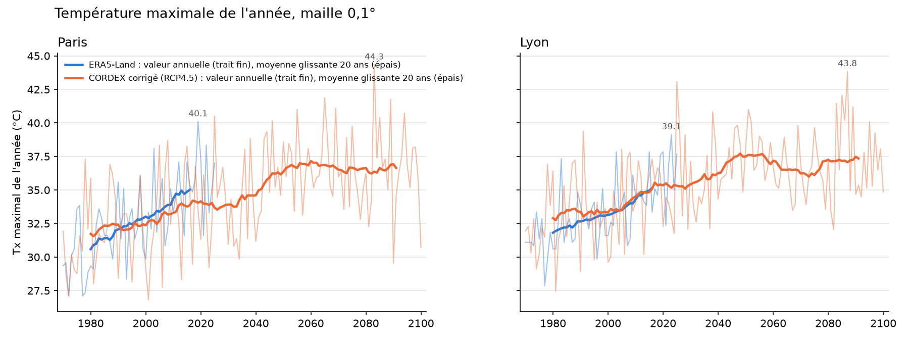

# Modèle actuel : bilan sur la France

CORDEX EUR-11, EC-EARTH r12i1p1 / SMHI-RCA4, `historical` puis `rcp_4_5`, corrigé par QDM contre ERA5-Land à 0,1° (températures) et ERA5 à 0,25° (précipitations). Moyennes sur la France métropolitaine, écarts à 1976-2005. Constats des 2 et 3 octobre 2026.

En bref : un RCP4.5 conforme aux projections de Météo-France, mais déjà en retard de 15 à 20 ans sur le climat observé. Le site montre un futur trop frais.

## 1. Conforme aux projections RCP4.5

| Écart à 1976-2005 | Modèle | DRIAS-2020, médiane [C5 ; C95] [1] |
|---|---|---|
| Température, année, 2071-2100 | +2,1 K | +2,1 [+1,6 ; +2,7] |
| Température, été, 2071-2100 | +2,6 K | +2,2 [+1,1 ; +3,3] |
| Précipitations, hiver, 2071-2100 | +10,6 % | +14,8 % [+10,4 ; +28,8] |
| Précipitations, été, 2071-2100 | −12,8 % | −11,1 % [−27,0 ; +10,5] |

Le couple n'est pas un modèle froid : sous RCP8.5, il est au-dessus de la médiane d'Explore2 (+4,3 contre +4,0 K en fin de siècle) [2].

## 2. En retard sur le climat observé

| | ERA5-Land | Modèle |
|---|---|---|
| Température, année, 2016-2025 | +1,43 K | +0,99 K |
| Température, été, 2016-2025 | +1,89 K | +1,32 K |
| Tx maximal annuel à Paris, moyenne glissante sur 20 ans vers 2015 | 35 °C | 34 °C |

Niveaux de réchauffement de la TRACC (France, par rapport à 1976-2005), même règle de 20 ans [3] :

| Niveau | TRACC | Modèle |
|---|---|---|
| +1,4 K | 2030 (déjà atteint par ERA5-Land sur 2016-2025) | 2046 |
| +2,1 K | 2050 | 2080 |
| +3,4 K | 2100 | jamais (maximum +2,3 K) |

- 2022, année la plus chaude mesurée, devrait être la norme en 2050 selon Météo-France [4] ; dans le modèle, seulement à partir de 2069-2088.
- En 2090-2099, la France n'est que 0,6 K plus chaude que ce qu'ERA5-Land donne déjà pour 2016-2025.
- Fin de siècle face à la page grand public de Météo-France (trajectoire intermédiaire à forte) [4] : +2,2 K au lieu de +3 °C, 46,6 °C au plus au lieu de 50 °C.

## 3. Extrêmes

- À réchauffement égal, la chaleur est réaliste : jours à 35 °C ou plus et nuits au-dessus de 20 °C dans les fourchettes de la TRACC [5].
- Journée la plus chaude de l'année trop basse de 1 à 1,6 K (31,4 °C contre 33 °C sur 1976-2005 [5]) : ERA5-Land plafonne (40,1 °C à Paris en 2019 contre 42,6 °C mesurés).
- Gel trop fréquent : 56 jours par an contre 43 sur 1976-2005 [5], et un recul deux fois plus lent. Piste : Tn d'ERA5-Land trop froids en relief.

## 4. Causes et suite

- RCP4.5 est un scénario de stabilisation : forçage quasi stable dès 2070-2080. Les modèles régionaux de cette génération gardent des aérosols constants et ignorent l'effet du CO2 sur la végétation, d'où un été trop frais [6, 7] ; aucune simulation ne reproduit la circulation qui chauffe l'Europe de l'Ouest [8].
- Pour la suite, deux couples EURO-CORDEX-CMIP6 (EUR-12, environ 12 km) sont jugés plausibles par les critères de sélection d'EURO-CORDEX et déjà publiés sur ESGF, historique et quatre scénarios SSP compris : CNRM-ESM2-1 / ICON-CLM et MPI-ESM1-2-HR / ICON-CLM. Testés du 4 au 6 octobre 2026 : MPI-ESM1-2-HR / ICON-CLM (SSP3-7.0) est retenu pour remplacer ce couple, voir `docs/choix_modele_cmip6.md`. Il partage le retard sur le réchauffement récent ; un ajustement sur la TRACC reste à décider.

Scripts et données : `figures/climat/france_agregats.py`, `france_indicateurs.py`, `france_meteofrance.py`, `vagues_chaleur.py`, `txx_paris_lyon.py`.

## Références

1. Soubeyroux J.-M. et al. (Météo-France), *Les nouvelles projections climatiques de référence DRIAS 2020 pour la métropole*, 2021, p. 33 et 40. <https://www.gesteau.fr/sites/default/files/gesteau/content_files/document/rapport-DRIAS-2020-red3-2.pdf>
2. Marson P. et al., *Explore2 : synthèse sur les projections climatiques régionalisées*, 2024, p. 37 et annexe 2. <https://doi.org/10.57745/PUR7ML>
3. Météo-France, *À quel climat s'adapter en France selon la TRACC ? Partie 1*, p. 7. <https://meteofrance.com/sites/default/files/files/editorial/rapport-trajectoire-rechauffement-adaptation-changement-climatique-partie-1.pdf>
4. Météo-France, *Météo-France éclaire le climat en France jusqu'en 2100*, consultée le 3 octobre 2026. <https://meteofrance.com/changement-climatique/meteo-france-eclaire-le-climat-en-france-jusquen-2100>
5. Météo-France, *À quel climat s'adapter en France selon la TRACC ? Partie 2*, p. 17 à 23. <https://meteofrance.com/sites/default/files/files/editorial/rapport-trajectoire-rechauffement-adaptation-changement-climatique-partie-2.pdf>
6. Schumacher D. L. et al. (2024), *Communications Earth & Environment* 5, 182. <https://doi.org/10.1038/s43247-024-01332-8>
7. Schwingshackl C. et al. (2019), *Environmental Research Letters* 14 (11). <https://doi.org/10.1088/1748-9326/ab4949>
8. Vautard R. et al. (2023), *Nature Communications* 14. <https://doi.org/10.1038/s41467-023-42143-3>
